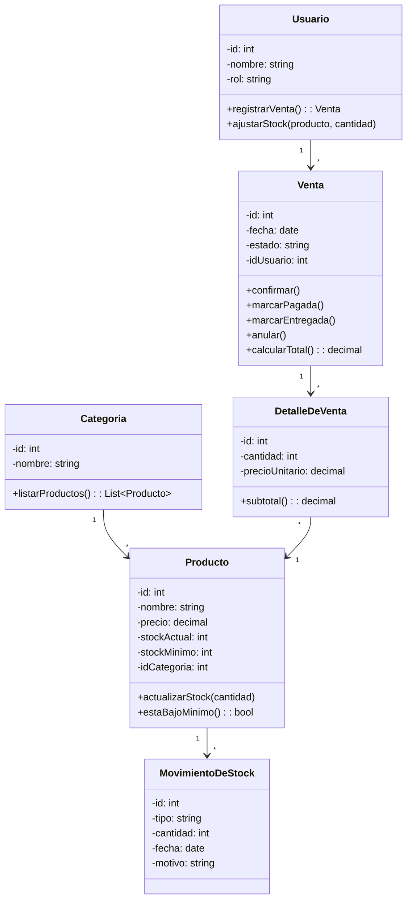
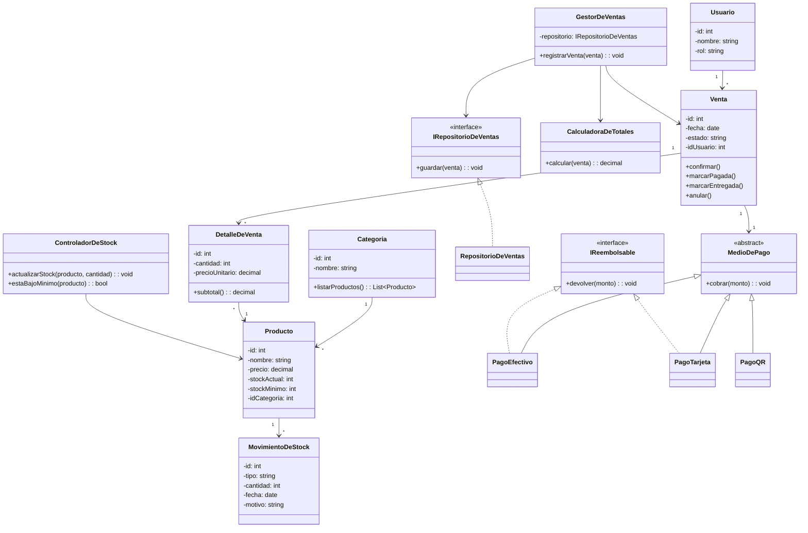

## ANTES (diagrama original)

**Nota**: 
- `Usuario.registrarVenta()` + `ajustarStock()`: un rol concentrando operaciones de dos responsabilidades distintas (vender y gestionar stock) → análogo a la clase gorda.
- `Producto.actualizarStock()` + `estaBajoMinimo()` y `Venta.calcularTotal()`: lógica de negocio embebida en la entidad en vez de en un servicio dedicado → mismo síntoma que un `new` incrustado (la entidad "fabrica" su propio comportamiento en vez de delegarlo).
- No existe manejo de medios de pago; si se agregara como `if/switch` sobre un string, sería el vicio explícito que pide el enunciado — se previene antes de que ocurra.

## DESPUÉS (SOLID aplicado)

## Qué cambié y qué principio lo pidió

- Saqué `actualizarStock()`/`estaBajoMinimo()` de `Producto` hacia `ControladorDeStock`, y `calcularTotal()` de `Venta` hacia `CalculadoraDeTotales`: cada entidad tenía lógica que no era su única razón de cambio (SRP). 
- Saqué `registrarVenta()`/`ajustarStock()` de `Usuario`: un rol no debe cargar operaciones de dos módulos distintos, eso pasó a `GestorDeVentas` y `ControladorDeStock` (SRP). 
- Agregué `IRepositorioDeVentas` como contrato entre `GestorDeVentas` y la persistencia, en vez de que la clase dependa de una implementación concreta de base de datos (DIP). 
- Introduje `MedioDePago`/`IReembolsable` para prevenir el switch por tipo de pago que el enunciado marca como vicio típico: `PagoQR` no implementa `IReembolsable`, así ninguna subclase promete una devolución que no puede cumplir (LSP). 
- `Categoria`, `DetalleDeVenta` y `MovimientoDeStock` quedaron sin cambios porque ya cumplían una responsabilidad única en el diseño original.