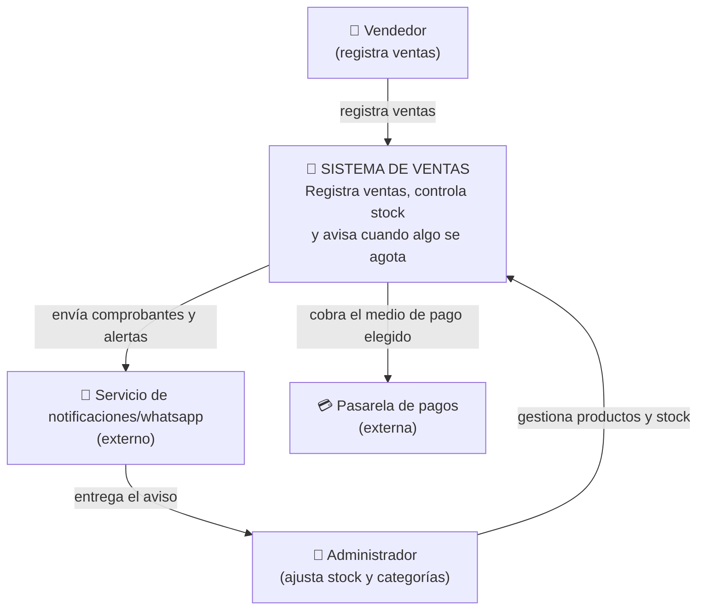

# C4 — Sistema de Ventas
 
## Nivel 1 — Contexto
 

```mermaid
flowchart TB
    vendedor["👤 Vendedor<br>(registra ventas)"]
    admin["👤 Administrador<br>(ajusta stock y categorías)"]
 
    sistema["🛒 SISTEMA DE VENTAS<br>Registra ventas, controla stock<br>y avisa cuando algo se agota"]
    correo["📧 Servicio de notificaciones/whatsapp<br>(externo)"]
    pasarela["💳 Pasarela de pagos<br>(externa)"]
 
    vendedor -->|"registra ventas"| sistema
    admin -->|"gestiona productos y stock"| sistema
    sistema -->|"envía comprobantes y alertas"| correo
    correo -->|"entrega el aviso"| admin
    sistema -->|"cobra el medio de pago elegido"| pasarela
```

