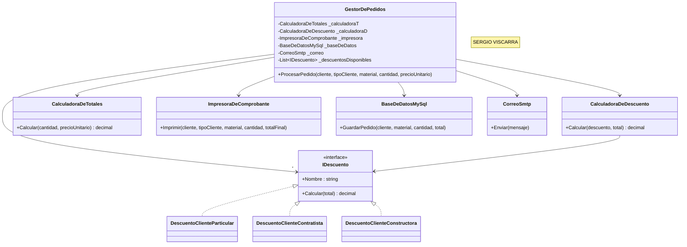

# Diagrama de clases — Ferretería "El Tornillo"
### Diagrama por: SERGIO VISCARRA

```mermaid
classDiagram
    note "SERGIO VISCARRA"

    class IDescuento {
        <<interface>>
        +Nombre : string
        +Calcular(total) decimal
    }
    class DescuentoClienteParticular
    class DescuentoClienteContratista
    class DescuentoClienteConstructora
    class CalculadoraDeDescuento {
        +Calcular(descuento, total) decimal
    }

    class CalculadoraDeTotales {
        +Calcular(cantidad, precioUnitario) decimal
    }
    class ImpresoraDeComprobante {
        +Imprimir(cliente, tipoCliente, material, cantidad, totalFinal)
    }
    class BaseDeDatosMySql {
        +GuardarPedido(cliente, material, cantidad, total)
    }
    class CorreoSmtp {
        +Enviar(mensaje)
    }

    class GestorDePedidos {
        -CalculadoraDeTotales _calculadoraT
        -CalculadoraDeDescuento _calculadoraD
        -ImpresoraDeComprobante _impresora
        -BaseDeDatosMySql _baseDeDatos
        -CorreoSmtp _correo
        -List~IDescuento~ _descuentosDisponibles
        +ProcesarPedido(cliente, tipoCliente, material, cantidad, precioUnitario)
    }

    IDescuento <|.. DescuentoClienteParticular
    IDescuento <|.. DescuentoClienteContratista
    IDescuento <|.. DescuentoClienteConstructora

    GestorDePedidos --> CalculadoraDeTotales
    GestorDePedidos --> CalculadoraDeDescuento
    GestorDePedidos --> ImpresoraDeComprobante
    GestorDePedidos --> BaseDeDatosMySql
    GestorDePedidos --> CorreoSmtp
    GestorDePedidos --> "*" IDescuento
    CalculadoraDeDescuento --> IDescuento
```