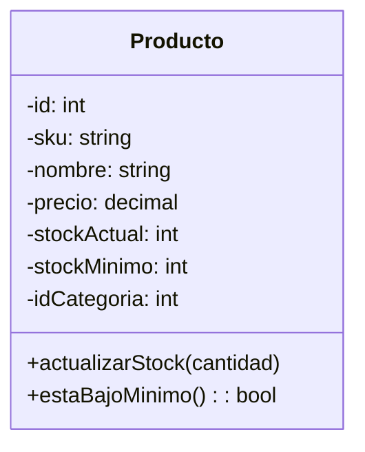
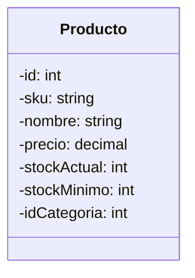
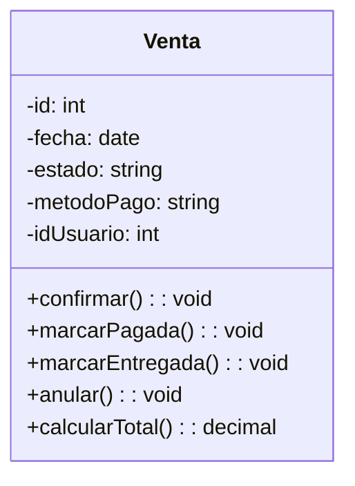
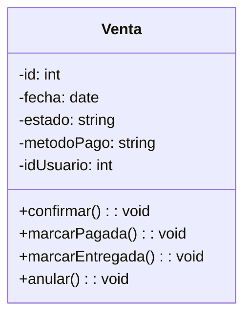

# Refactor SRP — Diagrama de clases

## Producto

**Por qué**: `ControladorDeStock` ya tenía `descontar()`, `ajustar()` y `estaBajoMinimo()`. Con esos mismos métodos también en `Producto`, había dos lugares mutando/evaluando stock — riesgo de desfase (justo lo que el atributo de idoneidad funcional busca evitar). `Producto` queda como dato puro; el control de stock tiene un solo dueño.

**Antes**

**Después**

## Venta

**Por qué**: `CalculadoraDeTotales` ya calcula el total a partir de `DetalleDeVenta`. Duplicarlo en `Venta` mezclaba dos razones de cambio: reglas de transición de estado y reglas de cálculo monetario. `Venta` queda enfocada solo en su ciclo de estados (carrito → confirmada → pagada → entregada/anulada).

**Antes**

**Después**

## Resultado

Cada clase de servicio (`CalculadoraDeTotales`, `ControladorDeStock`, `RepositorioDeVentas`, `RepositorioDeProductos`, `NotificadorDeStockBajo`, `GeneradorDeReportes`) tiene una única razón de cambio, y las entidades (`Producto`, `Venta`, etc.) quedan como portadoras de datos y reglas de estado propias, sin lógica de negocio ajena.
