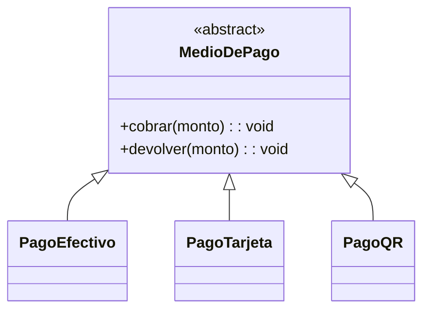
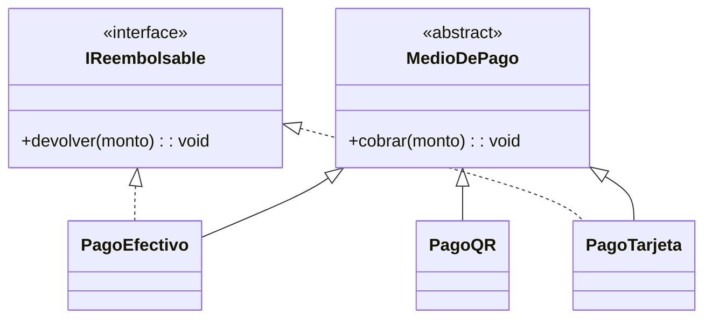

# Observación LSP — Diagrama de clases

## Estado actual

El diagrama de clases vigente no presenta jerarquías de herencia entre sus clases: todas (`Producto`, `Venta`, `Usuario`, clases de servicio, etc.) son independientes, sin relaciones `extends`. Por lo tanto, **hoy no hay violación de LSP** — el principio exige sustituibilidad entre clase base y derivadas, y ese escenario todavía no existe en el modelo.

## Riesgo latente

`Venta` guarda `metodoPago` como un dato plano (`string`). Si en una futura iteración se modela como jerarquía de clases (`PagoEfectivo`, `PagoTarjeta`, `PagoQR`), aparece el mismo riesgo que en el ejercicio LSP repasado: `Venta.anular()` necesitaría devolver el pago, y no todo medio de pago admite devolución (ej. QR). Forzar `Devolver()` en la clase base y que una subclase la implemente lanzando una excepción rompe el contrato del padre.

## Diseño preventivo (no aplicado al diagrama base)

**Antes** (violaría LSP si se implementara así)

`PagoQR.devolver()` heredaría un método que no puede cumplir, obligando a lanzar una excepción en tiempo de ejecución.

**Después** (respeta LSP: se separa lo que no todos garantizan)

`PagoQR` no implementa `IReembolsable`. Quien procesa una anulación verifica el tipo (`is IReembolsable`) antes de invocar `devolver()`, en vez de heredar un contrato que puede fallar.

## Resultado

Queda como constancia de diseño: si `metodoPago` evoluciona a una jerarquía de clases, debe separarse la capacidad de cobrar (garantizada por todos) de la capacidad de devolver (no garantizada por todos), evitando así una violación de LSP.