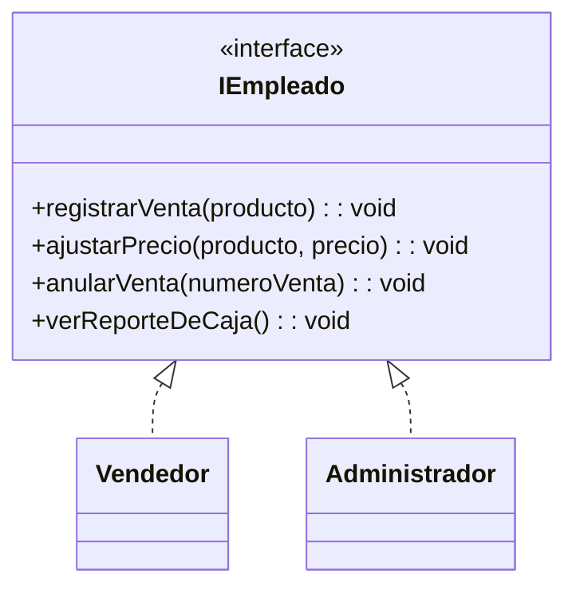
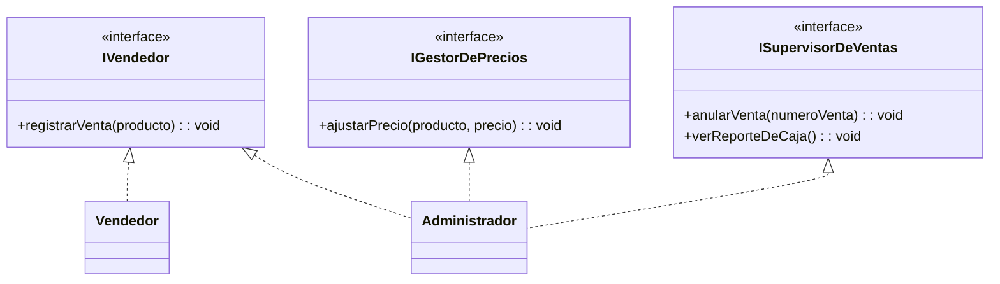

# Observación ISP — Diagrama de clases

## Estado actual

El diagrama de clases vigente no define interfaces: las clases de servicio (`GestorDeVentas`, `ControladorDeStock`, `RepositorioDeVentas`, etc.) son concretas e independientes, sin contratos compartidos. Por lo tanto, **hoy no hay violación de ISP** — el principio exige que ninguna clase se vea forzada a implementar métodos que no usa, y sin interfaces ese escenario no aplica todavía.

## Riesgo latente

`Usuario` guarda `rol` como dato plano (`string`), sin comportamiento asociado. Si en una futura iteración se centralizan las operaciones de vendedor y administrador en una única interfaz (ej. `IEmpleado` con `registrarVenta()`, `ajustarPrecio()`, `anularVenta()`, `verReporteDeCaja()`), aparece el mismo riesgo del ejercicio ISP repasado: un usuario con rol vendedor quedaría forzado a implementar `ajustarPrecio()` o `verReporteDeCaja()`, operaciones que no le corresponden y que solo tendría sentido lanzar como excepción.

## Diseño preventivo (no aplicado al diagrama base)

**Antes** (violaría ISP si se implementara así)

`Vendedor` heredaría métodos que no puede cumplir (`ajustarPrecio`, `anularVenta`, `verReporteDeCaja`), obligando a lanzar excepciones en tiempo de ejecución.

**Después** (respeta ISP: interfaces segregadas por capacidad)

`Vendedor` solo implementa `IVendedor`. `Administrador` implementa las tres interfaces, sin que ninguna clase cargue con métodos que no usa.

## Resultado

Queda como constancia de diseño: si `Usuario.rol` evoluciona hacia una jerarquía de interfaces por tipo de operación, deben segregarse por capacidad (vender, gestionar precios, supervisar) en vez de un contrato único, evitando así una violación de ISP.