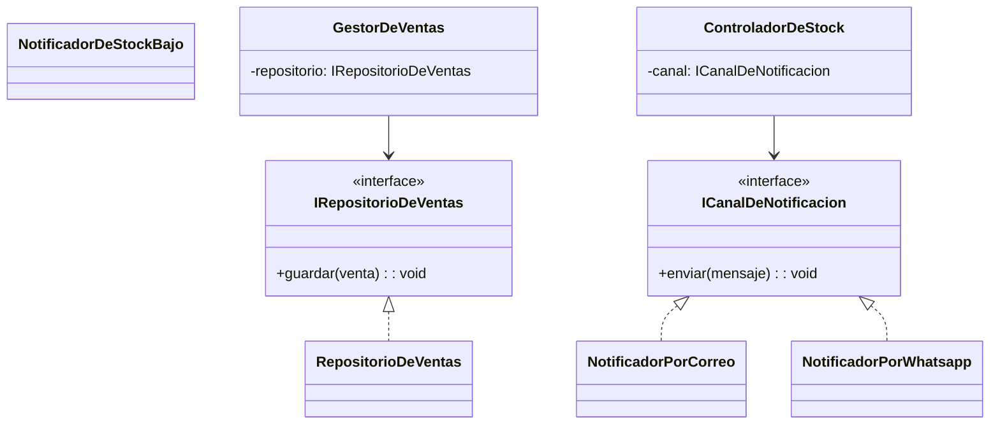
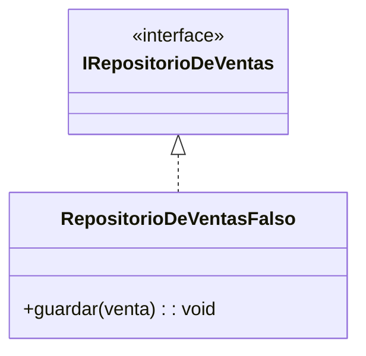

# Observación DIP — Diagrama de clases

## ¿Dónde fabrica el negocio sus detalles?

Tres puntos del diagrama tocan infraestructura concreta directamente:

- **`RepositorioDeVentas`** y **`RepositorioDeProductos`**: fabrican acceso a base de datos (persistencia).
- **`NotificadorDeStockBajo`**: fabrica el canal de aviso (correo, push, SMS — el diagrama no lo aclara, pero es un detalle externo).
- **`GeneradorDeReportes`**: lee datos de venta, probablemente también contra base de datos.

Hoy `GestorDeVentas` y `ControladorDeStock` dependen de estas clases concretas (`GestorDeVentas --> RepositorioDeVentas`, `ControladorDeStock --> NotificadorDeStockBajo`), igual que `GeneradorDeReporteDeVentas` dependía directo de `BaseDeDatosSqlServer` y `CorreoSmtp` en el ejercicio antes del fix.

## Contrato que libera la dependencia

`GestorDeVentas` y `ControladorDeStock` dejan de conocer `RepositorioDeVentas` o `NotificadorDeStockBajo` como clases concretas; dependen del contrato (`IRepositorioDeVentas`, `ICanalDeNotificacion`), igual que `GeneradorDeReporteDeVentas` pasó a depender de `IOrigenDeVentas` e `ICanalDeAviso` en el ejercicio.

## ¿Se podría probar sin el detalle real conectado?

Sí. Con el contrato de por medio, se puede inyectar un doble de prueba sin tocar base de datos ni servicios externos — igual que `VentasDePrueba` reemplazó a `BaseDeDatosSqlServer` en el ejercicio:

`RepositorioDeVentasFalso` simula el guardado en memoria; `GestorDeVentas` no distingue si recibe el repositorio real o el falso, porque solo conoce la interfaz. Esto permite probar `registrarVenta()` sin una base de datos real conectada.

## Resultado

Queda como constancia de diseño: los puntos que fabrican detalles de infraestructura (`RepositorioDeVentas`, `RepositorioDeProductos`, `NotificadorDeStockBajo`) deberían depender de una interfaz, no de la implementación concreta, para que las clases de orquestación (`GestorDeVentas`, `ControladorDeStock`) sean testeables y reemplazables sin cambiar su código.